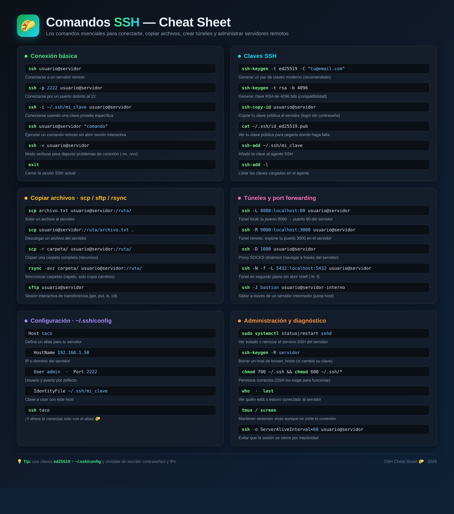

# Comandos SSH — Cheat Sheet 🌮



Lista completa de comandos SSH esenciales. La imagen (`ssh-cheatsheet.png`) se genera a partir de `ssh-cheatsheet.html`.

## Conexión básica

| Comando | Descripción |
|---|---|
| `ssh usuario@servidor` | Conectarse a un servidor remoto |
| `ssh -p 2222 usuario@servidor` | Conectarse por un puerto distinto al 22 |
| `ssh -i ~/.ssh/mi_clave usuario@servidor` | Conectarse usando una clave privada específica |
| `ssh usuario@servidor "comando"` | Ejecutar un comando remoto sin abrir sesión interactiva |
| `ssh -v usuario@servidor` | Modo verbose para depurar problemas de conexión (`-vv`, `-vvv`) |
| `exit` | Cerrar la sesión SSH actual |

## Claves SSH

| Comando | Descripción |
|---|---|
| `ssh-keygen -t ed25519 -C "tu@email.com"` | Generar un par de claves moderno (recomendado) |
| `ssh-keygen -t rsa -b 4096` | Generar clave RSA de 4096 bits (compatibilidad) |
| `ssh-copy-id usuario@servidor` | Copiar tu clave pública al servidor (login sin contraseña) |
| `cat ~/.ssh/id_ed25519.pub` | Ver tu clave pública |
| `ssh-add ~/.ssh/mi_clave` | Añadir la clave al agente SSH |
| `ssh-add -l` | Listar las claves cargadas en el agente |

## Copiar archivos · scp / sftp / rsync

| Comando | Descripción |
|---|---|
| `scp archivo.txt usuario@servidor:/ruta/` | Subir un archivo al servidor |
| `scp usuario@servidor:/ruta/archivo.txt .` | Descargar un archivo del servidor |
| `scp -r carpeta/ usuario@servidor:/ruta/` | Copiar una carpeta completa (recursivo) |
| `rsync -avz carpeta/ usuario@servidor:/ruta/` | Sincronizar carpetas (rápido, solo copia cambios) |
| `sftp usuario@servidor` | Sesión interactiva de transferencia (`get`, `put`, `ls`, `cd`) |

## Túneles y port forwarding

| Comando | Descripción |
|---|---|
| `ssh -L 8080:localhost:80 usuario@servidor` | Túnel local: tu puerto 8080 → puerto 80 del servidor |
| `ssh -R 9000:localhost:3000 usuario@servidor` | Túnel remoto: expone tu puerto 3000 en el servidor |
| `ssh -D 1080 usuario@servidor` | Proxy SOCKS dinámico (navegar a través del servidor) |
| `ssh -N -f -L 5432:localhost:5432 usuario@servidor` | Túnel en segundo plano sin abrir shell |
| `ssh -J bastion usuario@servidor-interno` | Saltar a través de un servidor intermedio (jump host) |

## Configuración · `~/.ssh/config`

```ssh-config
Host taco
  HostName 192.168.1.50
  User admin
  Port 2222
  IdentityFile ~/.ssh/mi_clave
```

Y ahora te conectas solo con el alias: `ssh taco` 🌮

## Administración y diagnóstico

| Comando | Descripción |
|---|---|
| `sudo systemctl status sshd` / `restart sshd` | Ver estado o reiniciar el servicio SSH del servidor |
| `ssh-keygen -R servidor` | Borrar un host de `known_hosts` (si cambió su clave) |
| `chmod 700 ~/.ssh && chmod 600 ~/.ssh/*` | Permisos correctos (SSH los exige para funcionar) |
| `who` · `last` | Ver quién está o estuvo conectado al servidor |
| `tmux` / `screen` | Mantener sesiones vivas aunque se corte la conexión |
| `ssh -o ServerAliveInterval=60 usuario@servidor` | Evitar que la sesión se cierre por inactividad |

## Regenerar la imagen

```bash
chromium --headless --hide-scrollbars --force-device-scale-factor=2 \
  --window-size=1500,1700 --screenshot=ssh-cheatsheet.png ssh-cheatsheet.html
```
